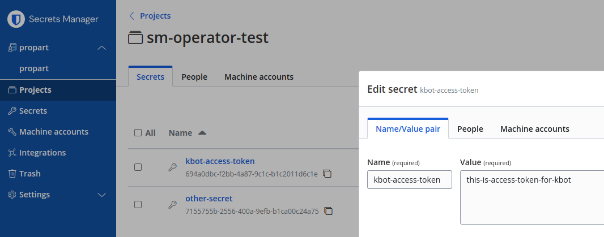

# bitwarden/sm-operator

Цей проєкт містить [графічний інтерфейс](gui/index.html), за допомогою якого можна згенерувати 
маніфест для об'єкта `BitwardenSecret`.

## Встановити за допомогою Helm

```sh
helm upgrade sm-operator bitwarden/sm-operator -i --debug -n sm-operator-system --create-namespace --values my-values.yaml --devel
```

## Як налаштувати `bitwarden/sm-operator` і створити секрет

### 1. Створимо секрет `bw-auth-token` з токеном для Bitwarden machine account

```sh
read -s BWS_MACHINE_TOKEN
export BWS_MACHINE_TOKEN

kubectl create secret generic bw-auth-token -n default --from-literal=token="${BWS_MACHINE_TOKEN}"
```

### 2. Створимо об'єкт `BitwardenSecret`

Цей об'єкт повідомляє оператору `bitwarden/sm-operator`, що треба створити секрет. Об'єкт `BitwardenSecret` містить наступну інформацію

- назву серкету `authToken.secretName` та назву поля `authToken.secretKey` в цьому секреті, де зберігається токен для machine account
- ID організації `organizationId`
- назву для секрету `secretName`, який буде створено
- інструкції для мапінгу: узяти значення зі секрету `map[].bwSecretId` і записати його у новостворений секрет під іменем `map[].secretKeyName`

```sh
cat <<EOF | kubectl apply -n default -f -
apiVersion: k8s.bitwarden.com/v1
kind: BitwardenSecret
metadata:
  labels:
    app.kubernetes.io/name: bitwardensecret
    app.kubernetes.io/instance: bitwardensecret-sample
    app.kubernetes.io/part-of: sm-operator
    app.kubernetes.io/managed-by: kustomize
    app.kubernetes.io/created-by: sm-operator
  name: bitwardensecret-sample
spec:
  organizationId: "00000000-aaaa-bbbb-cccc-dddddddddddd"
  secretName: kbot-secret
  map:
    - bwSecretId: "11111111-aaaa-bbbb-cccc-dddddddddddd"
      secretKeyName: kbot-token
  authToken:
    secretName: bw-auth-token
    secretKey: token
EOF
```



### 3. Перевіримо, чи створився обє'кт `Secret`

`kubectl get secrets kbot-secret -o yaml`:

```yaml
apiVersion: v1
data:
  kbot-token: dGhpcy1pcy1hY2Nlc3MtdG9rZW4tZm9yLWtib3Q=
kind: Secret
metadata:
  name: kbot-secret
  namespace: default
type: Opaque
```

`kubectl get secrets kbot-secret -o jsonpath="{.data.kbot-access-token}" | base64 -d`:

```
this-is-access-token-for-kbot
```

## Особливості роботи оператора

Якщо видалити об'єкт `BitwardenSecret`, то автоматично буде видалено і секрет, створений на його основі.

Оператор запише у новостворений об'єкт `Secret` всі секрети, доступні для заданого токену (machine account), а не тільки ті, які задані в мапінгу.
Тобто всі секрети, які виведе команда `bws secret list` з цим токеном, будуть в результуючому секреті.

Якщо не використовувати мапінг, то в якості назви поля буде використовуватись UUID секрету.

Я змінив мапінг в об'єкті `BitwardenSecret`, але зміни не застосувалися до секрету. Треба було видалити `BitwardenSecret` і створити його заново.
Я додав новий секрет в Bitwarden, доступний для поточного machine account, але цей секрет не з'явився в об'єкті `Secret`.
Треба дослідити питання, які зміни відслідковує оператор, а які -- ні.

## Misc

```yaml
apiVersion: v1
data:
  kbot-access-token: dGhpcy1pcy1hY2Nlc3MtdG9rZW4tZm9yLWtib3Q=
kind: Secret
metadata:
  annotations:
    k8s.bitwarden.com/custom-map: |-
      [
        {
          "bwSecretId": ""11111111-aaaa-bbbb-cccc-dddddddddddd"",
          "secretKeyName": "kbot-access-token"
        }
      ]
    k8s.bitwarden.com/sync-time: "2024-08-05T08:44:34.882535249Z"
  creationTimestamp: "2024-08-05T08:44:34Z"
  labels:
    k8s.bitwarden.com/bw-secret: 755b2370-bbe7-4e6c-84df-5f0b8a3e826e
  name: kbot-secret
  namespace: default
  ownerReferences:
    - apiVersion: k8s.bitwarden.com/v1
      blockOwnerDeletion: true
      controller: true
      kind: BitwardenSecret
      name: bitwardensecret-sample
      uid: 755b2370-bbe7-4e6c-84df-5f0b8a3e826e
  resourceVersion: "7505"
  uid: eba3f7ad-3954-4872-ac90-2a3099de02fa
type: Opaque
```

```json
{
  "apiUrl": "https://api.bitwarden.eu",
  "deviceType": "SDK",
  "identityUrl": "https://identity.bitwarden.com",
  "userAgent": "Bitwarden GOLANG-SDK"
}
```

Приклад того, як виглядатиме секрет, коли одне поле замаплене, а одне -- ні:

```yaml
apiVersion: v1
data:
  7155755b-2556-400a-9efb-b1ca00c24a75: b3RoZXItc2VjcmV0LXZhbHVl
  kbot-token: dGhpcy1pcy1hY2Nlc3MtdG9rZW4tZm9yLWtib3Q=
kind: Secret
metadata:
  name: kbot-secret
  namespace: default
type: Opaque
```

## Resources

- [Secrets Manager Kubernetes Operator](https://bitwarden.com/help/secrets-manager-kubernetes-operator/)
